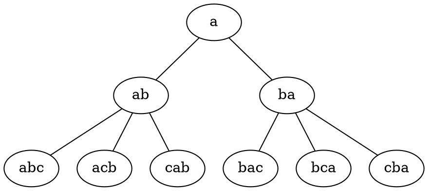
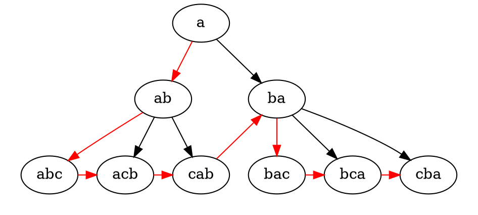
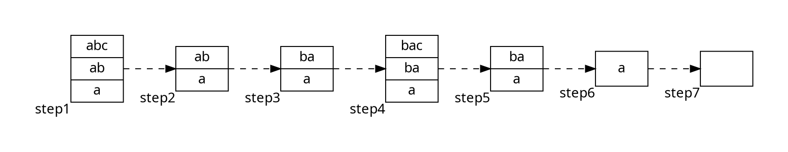

---
html:

    toc: true
    toc_depth: 6
    toc_float: true
        collapsed: false
        smooth_scroll: true

---
<!-- @import "[TOC]" {cmd="toc" depthFrom=1 depthTo=6 orderedList=false} -->

# Meta-Loopless Sorts

<!-- code_chunk_output -->

- [Meta-Loopless Sorts](#meta-loopless-sorts)
  - [1. 题目](#1-题目)
    - [Sample Input](#sample-input)
    - [Sample Output](#sample-output)
    - [1.1 题意](#11-题意)
  - [2. 思路](#2-思路)
    - [2.1 问题](#21-问题)
  - [3. 实现](#3-实现)

<!-- /code_chunk_output -->

## 1. 题目

Sorting holds an important place in computer science. Analyzing and implementing various sorting algorithms forms an important part of the education of most computer scientists, and sorting accounts for a significant percentage of the world’s computational resources. Sorting algorithms range from the bewilderingly popular Bubble sort, to Quicksort, to parallel sorting algorithms and sorting networks. In this problem you will be writing a program that creates a sorting program (a meta-sorter).

The problem is to create several programs whose output is a standard Pascal programs that sorts
n numbers where n is the only input to the program you will write. The Pascal program generated by
your program must have the following properties:

* They must begin with program sort(input, output)；

* They must declare storage for exactly n integer variables. The names of the variables must come
from the first n letters of the alphabet (a, b, c, d, e, f).

* A single readln statement must read in values for all the integer variables.

* Other than writeln statements, the only statements in the program are if then else statements. The boolean conditional for each if statement must consist of one strict inequality (either < or \> ) of two integer variables. Exactly n! writeln statements must appear in the program.

* Exactly three semi-colons must appear in the programs

  1. after the program header: program sort(input,output);

  2. after the variable declaration: ... : integer;

  3. after the readln statement: readln(...);

* No redundant comparisons of integer variables should be made. For example, during program
execution, once it is determined that a < b, variables a and b should not be compared again.

* Every writeln statement must appear on a line by itself.

* The programs must compile. Executing the program with input consisting of any arrangement of
any n distinct integer values should result in the input values being printed in sorted order.

For those unfamiliar with Pascal syntax, the example at the end of this problem completely defines
the small subset of Pascal needed.

Input

The input consist on a number in the first line indicating the number M of programs to make, followed
by a blank line. Then there are M test cases, each one consisting on a single integer n on a line by
itself with 1 <= n <= 8.

There will be a blank line between test cases.

Output

The output is M compilable standard Pascal programs meeting the criteria specified above.

Print a blank line between two consecutive programs.

### Sample Input

1

3

### Sample Output

```pascal

program sort(input,output);  
var  
a,b,c : integer;  
begin  
    readln(a,b,c);  
    if a < b then  
        if b < c then  
            writeln(a,b,c)  
        else if a < c then  
            writeln(a,c,b)  
        else  
            writeln(c,a,b)  
    else  
        if a < c then  
            writeln(b,a,c)  
        else if b < c then  
            writeln(b,c,a)  
        else  
            writeln(c,b,a)  
end. 
```

### 1.1 题意

题目输入给出两组数字，第一组n表示生成多少个程序，每一个程序有一个输入N，N表示待排序的元素个数。sample中输入为1 3，1表示有一个程序，3表示待排序的元素个数为3. 给出的输出是一个pascal程序，程序接受3个输入，并通过枚举比较元素大小。

## 2. 思路

题意是根据输入的数字输出一个pascal程序，程序是枚举输入变量并进行排序。通过观察给定的输出，发现问题可以抽取为对给定数目的字符做全排列，并按照指定的格式输出。

按照题意，很自然的先想到递归，递归大致框架如下：遍历过程和选择排序类似，以a, b, c三个元素为例，最开始list有一个元素a，接下来判断b>a或者b&lt; a, 得到ab或ba；如果a&lt; b, 接下来插入c有三种可能abc, acb, cab. 通过递归在list中插入元素，最终得到的list元素个数和待排序元素个数相等，则递归结束。

```java

print(list){
    int size = list.size();
    //如果list元素个数等于待排序元素个数，则递归结束，输出。
    for(int i= size-1; i>=0; i--){
         //list添加元素
         list.add(ele);
         //根据i选择输出if/else if/else
        print(list);
    } 
}
```

按照递归的思路提交了代码，结果超时(超时不一定由递归引起), 所以考虑改为非递归方式。将上面的递归所有可能情形列举出来，并根据case之间的联系(插入排序时，比较并插入该元素，所以每个非叶节点的子节点为该节点添加下一个元素的所有可能情形), 得到了一颗树，如下：



通过对树的遍历我们即可构造出所需要的程序，遍历顺序为：



采用非递归方式，我们需要用栈保存非叶节点, 并在遍历完当前节点的子叶子节点后，获取到当前节点的兄弟节点。以a, b, c节点为例，令排序元素个数为N:  

* 先将a, ab, abc入栈，得到step1；
* 遍历abc的兄弟节点并输出，然后abc节点出栈，得到step2；
* 取出栈顶元素，寻找该节点的下一个节点，也就是上述树图中相邻的兄弟节点，并入栈。这里我们得到step3的栈；
* 由于栈顶数组元素个数小于N，所以需要入栈最左子节点，这里是bac，得到step4；
* 此时栈和step1是一样的情况，栈顶兄弟节点遍历并出栈，得到step5；
* ba出栈，由于ba的下一个兄弟节点不存在，所以没有节点入栈，得到step6；
* a出栈，且a没有兄弟节点，此时栈为空，过程结束。

整个过程有两个关键的点：

  1. 如果栈顶数组元素个数等于N，输出该节点及所有兄弟节点，并出栈；
  2. 如果栈顶数组元素个数小于N，出栈，并获取节点下一个节点；如果下一个节点为空，继续当前过程直到栈为空或者下一个节点存在，然后入栈；不为空则直接入栈。入栈之后如果元素个数小于N，则需要入栈该节点的最左子节点，重复与N判断，直到栈顶数组元素个数为N。



### 2.1 问题

在实现过程中提交之后遇到了超时的问题，通过使用idea的profile工具，发现耗时主要集中在format上。在最初实现版本中，所有的输出都是及时输出，使用printf("%s, ", str)这种格式，因为系统会大量循环多次调用printf，导致超时。通过将printf改为StringBuilder，将待输出字符串拼接，减少printf的调用次数，从而减少运行时间。

## 3. 实现

```JAVA
// JAVA
import java.io.File;
import java.io.FileNotFoundException;
import java.util.ArrayList;
import java.util.List;
import java.util.Scanner;
import java.util.Stack;

public class Main {
    private static char[] alphabeta = {'a', 'b', 'c', 'd', 'e', 'f', 'g', 'h', 'i', 'j'};

    public static void main(String[] args) {
        File file = new File("number.txt");
        Scanner scanner = null;
        try {
            scanner = new Scanner(file);
        } catch (FileNotFoundException e) {
            throw new RuntimeException(e);
        }
//        Scanner scanner = new Scanner(System.in);

        while (scanner.hasNext()) {

            int numOfProgram = scanner.nextInt();
            for (int i = 0; i < numOfProgram; i++) {
                int number = scanner.nextInt();
                StringBuilder result = new StringBuilder();
                result.append("program sort(input,output);\n");
                result.append("var\n");
                StringBuilder sb = new StringBuilder();
                sb.append(alphabeta[0]);
                for (int j = 1; j < number; j++) {
                    sb.append(",");
                    sb.append(alphabeta[j]);
                }
                result.append(sb.toString());
                result.append(" : integer;\n");
                result.append("begin\n");
                result.append("readln(");
                result.append(sb.toString());
                result.append(");\n");
                System.out.printf("%s", result.toString());
                print(number);
                System.out.printf("%s\n", "end.");
                if (i < numOfProgram - 1) {
                    System.out.printf("\n");
                }
            }
        }
    }

    /**
     * 打印主体结构
     */
    private static void print(int number) {
        StringBuilder sb = new StringBuilder();
        for (int i = 0; i < number; i++) {
            sb.append(alphabeta[i]);
        }

        /**
         * step1的入栈过程，执行完这些步骤后得到step1的栈
         */
        Stack<StringBuilder> stack = new Stack<>();
        for (int i = 0; i < number; i++) {
            StringBuilder locsb = new StringBuilder(sb.substring(0, i + 1));
            int length = locsb.length();
            StringBuilder sbblanks = new StringBuilder();
            for (int k = 1; k < length; k++) {
                sbblanks.append("  ");
            }
            String blanks = sbblanks.toString();
            if (length >= 2) {
                System.out.printf("%sif %c < %c then\n", blanks, locsb.charAt(length - 2), locsb.charAt(length - 1));
            }
            stack.push(locsb);
        }

        StringBuilder result = new StringBuilder();
        while (!stack.empty()) {
            StringBuilder peekStr = stack.pop();
            if (peekStr.length() == number) {
                //打印栈顶
                printPeek(peekStr, result);
            } else {
                //获取栈顶下一个节点
                peekStr = nextStr(peekStr);
                if (peekStr != null) {
                    printStr(peekStr, result);
                    stack.push(peekStr);
                    //栈顶数组元素个数小于N，则循环入栈，直至栈顶元素等于N
                    while (peekStr.length() < number) {
                        peekStr = new StringBuilder(peekStr);
                        peekStr.append(sb.charAt(peekStr.length()));
                        printStr(peekStr, result);
                        stack.push(peekStr);
                    }
                }
            }
        }
        System.out.printf("%s", result.toString());
    }

    /**
     * 打印栈顶，当栈顶数组元素个数等于N时
     */
    private static void printPeek(StringBuilder sb, StringBuilder result) {
        int length = sb.length();
        int index = length - 1;

        StringBuilder blanks = new StringBuilder();
        for (int i = 0; i < length - 1; i++) {
            blanks.append("  ");
        }
        String blank = blanks.toString();

        for (; index >= 0; index--) {
            if (index == length - 1) {
            } else if (index == 0) {
                result.append(blank);
                result.append("else\n");
            } else {
                result.append(blank);
                result.append("else if ");
                result.append(sb.charAt(index - 1));
                result.append(" < ");
                result.append(sb.charAt(length - 1));
                result.append(" then\n");

            }
            result.append(blank);
            result.append("writeln(");
            for (int i = 0; i < index; i++) {
                result.append(sb.charAt(i));
                result.append(",");
            }
            result.append(sb.charAt(length - 1));
            for (int i = index; i < length - 1; i++) {
                result.append(",");
                result.append(sb.charAt(i));
            }
            result.append(")\n");
        }

    }

    /**
     * find next str，当栈顶数组元素个数小于N时，寻找下一个元素
     *
     * @param sb
     * @return
     */
    private static StringBuilder nextStr(StringBuilder sb) {
        int index = 0, maxIndex = 0;
        for (int i = 0; i < sb.length(); i++) {
            if (sb.charAt(i) - 'a' > index) {
                index = sb.charAt(i) - 'a';
                maxIndex = i;
            }
        }
        char maxChar = sb.charAt(maxIndex);
        sb.deleteCharAt(maxIndex);
        if (maxIndex - 1 >= 0) {
            sb.insert(maxIndex - 1, maxChar);
        } else {
            return null;
        }
        return sb;
    }

    /**
     * 打印中间结果，主要是 if then/else if then /else
     *
     */
    private static void printStr(StringBuilder sb, StringBuilder result) {
        StringBuilder blanks = new StringBuilder();
        for (int i = 0; i < sb.length() - 1; i++) {
            blanks.append("  ");
        }
        String blank = blanks.toString();
        int index = 0, maxIndex = 0;
        for (int i = 0; i < sb.length(); i++) {
            if (sb.charAt(i) - 'a' > index) {
                index = sb.charAt(i) - 'a';
                maxIndex = i;
            }
        }

        if (maxIndex == 0) {
            result.append(blank);
            result.append("else\n");
        } else if (maxIndex == sb.length() - 1) {
            result.append(blank);
            result.append("if ");
            result.append(sb.charAt(maxIndex - 1));
            result.append(" < ");
            result.append(sb.charAt(maxIndex));
            result.append(" then\n");
        } else {
            result.append(blank);
            result.append("else if ");
            result.append(sb.charAt(maxIndex - 1));
            result.append(" < ");
            result.append(sb.charAt(maxIndex));
            result.append(" then\n");
        }
    }
}
```
