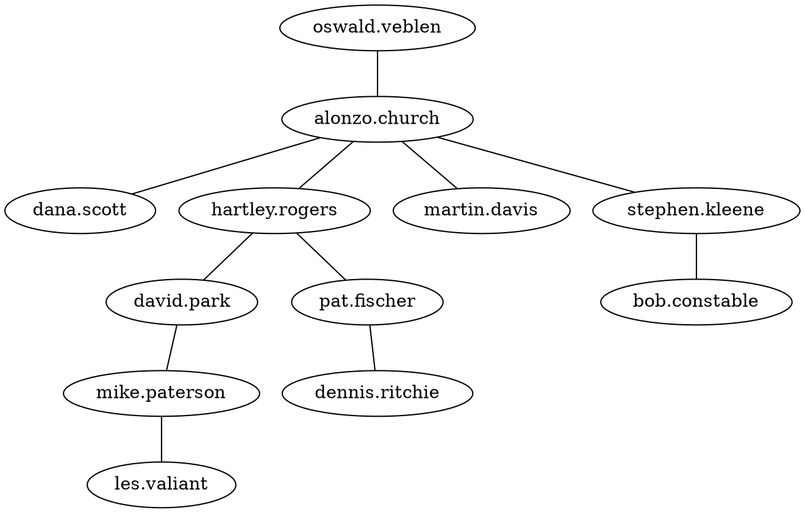
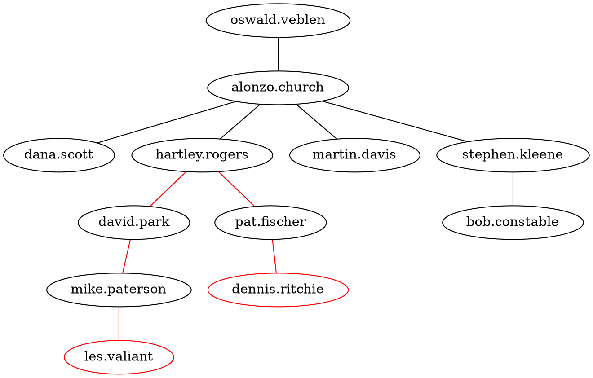
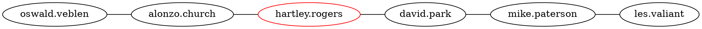
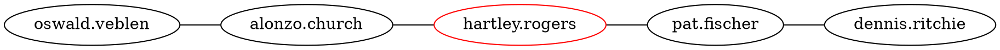

# Climbing Trees

## 1. 题目

Expression trees, B and B* trees, red-black trees, quad trees, PQ trees; trees play a significant role in many domains of computer science. Sometimes the name of a problem may indicate that trees are used when they are not, as in the Artificial Intelligence planning problem traditionally called the Monkey and Bananas problem. Sometimes trees may be used in a problem whose name gives no indication that trees are involved, as in the Huffman code.

This problem involves determining how pairs of people who may be part of a “family tree” are related.

Given a sequence of child-parent pairs, where a pair consists of the child’s name followed by the (single) parent’s name, and a list of query pairs also expressed as two names, you are to write a program to determine whether the query pairs are related. If the names comprising a query pair are related the program should determine what the relationship is. Consider academic advisees and advisors as exemplars of such a single parent genealogy (we assume a single advisor, i.e., no co-advisors).

In this problem the child-parent pair p q denotes that p is the child of q. In determining relationships
between names we use the following definitions:

* p is a 0-descendent of q (respectively 0-ancestor) if and only if the child-parent pair p q (respectively q p) appears in the input sequence of child-parent pairs.
  
* p is a k-descendent of q (respectively k-ancestor) if and only if the child-parent pair p r (respectively q r) appears in the input sequence and r is a (k - 1)-descendent of q (respectively p is a (k - 1)- ancestor of r).

For the purposes of this problem the relationship between a person p and a person q is expressed as exactly one of the following four relations:

1. child — grand child, great grand child, great great grand child, etc.
By definition p is the “child” of q if and only if the pair p q appears in the input sequence of child-parent pairs (i.e., p is a 0-descendent of q); p is the “grand child” of q if and only if p is a 1-descendent of q; and
$$p\ is\ the\ “\underbrace{ great\ great\ ...\ great}_{n\ times}\ grand\ child”\ of\ q$$
if and only if p is an (n + 1)-descendent of q.

2. parent — grand parent, great grand parent, great great grand parent, etc.
By definition p is the “parent” of q if and only if the pair q p appears in the input sequence of child-parent pairs (i.e., p is a 0-ancestor of q); p is the “grand parent” of q if and only if p is a 1-ancestor of q; and
$$p\ is\ the\ “\underbrace{great\ great\ ...\ great}_{n\ times}\ grand\ parent”\ of\ q$$
if and only if p is an (n + 1)-ancestor of q.

3. cousin — 0-th cousin, 1-st cousin, 2-nd cousin, etc.; cousins may be once removed, twice removed,three times removed, etc.
By definition p and q are “cousins” if and only if they are related (i.e., there is a path from p to q in the implicit undirected parent-child tree). Let r represent the least common ancestor of p and q (i.e., no descendent of r is an ancestor of both p and q), where p is an m-descendent of r and q is an n-descendent of r.

Then, by definition, cousins p and q are “k-th cousins” if and only if k = min(n, m), and, also by definition, p and q are “cousins removed j times” if and only if j =|n - m|.

4. sibling — 0-th cousins removed 0 times are “siblings” (they have the same parent).

### Input

The input consists of child-parent pairs of names, one pair per line. Each name in a pair consists of lower-case alphabetic characters or periods (used to separate first and last names, for example). Child names are separated from parent names by one or more spaces. Child-parent pairs are terminated by a pair whose first component is the string ‘no.child’. Such a pair is NOT to be considered as a child-parent pair, but only as a delimiter to separate the child-parent pairs from the query pairs. There will be no circular relationships, i.e., no name p can be both an ancestor and a descendent of the same name q.

The child-parent pairs are followed by a sequence of query pairs in the same format as the childparent pairs, i.e., each name in a query pair is a sequence of lower-case alphabetic characters and periods, and names are separated by one or more spaces. Query pairs are terminated by end-of-file.

There will be a maximum of 300 different names overall (child-parent and query pairs). All names will be fewer than 31 characters in length. There will be no more than 100 query pairs.

### Output

For each query-pair p q of names the output should indicate the relationship p is-the-relative-of q by the appropriate string of the form:

* child, grand child, great grand child, great great ... great grand child
* parent, grand parent, great grand parent, great great ... great grand parent
* sibling
* n cousin removed m
* no relation

If an m-cousin is removed 0 times then only ‘m cousin’ should be printed, i.e., ‘removed 0’ should NOT be printed. Do not print st, nd, rd, th after the numbers.

### Sample Input

alonzo.church oswald.veblen
stephen.kleene alonzo.church
dana.scott alonzo.church
martin.davis alonzo.church
pat.fischer hartley.rogers
mike.paterson david.park
dennis.ritchie pat.fischer
hartley.rogers alonzo.church
les.valiant mike.paterson
bob.constable stephen.kleene
david.park hartley.rogers
no.child no.parent
stephen.kleene bob.constable
hartley.rogers stephen.kleene
les.valiant alonzo.church
les.valiant dennis.ritchie
dennis.ritchie les.valiant
pat.fischer michael.rabin

### Sample Output

parent
sibling
great great grand child
1 cousin removed 1
1 cousin removed 1
no relation

### 1.1题意

题意是先给定多组人名对，每一对表示父子关系，然后给定多组人名对，判断每对的关系。题目共定义了四种关系：parent，child，cousin，sibling，每一种关系的具体定义见题目。

## 2. 思路

从关系出发，parent和child都是判断两个人名是否存在直接或间接的父子关系(父亲的父亲是儿子的grand parent), cousin是判断是否有共同祖先，从家族关系出发，有助于我们理清人物关系的是家谱，也就是家族树。

基于人物的关系，我们可以构造一棵家族树，树的子节点代表的人名表示是该节点的孩子。构造好家族树后，判断关系也变得理所当然起来。以节点p，q为例：

* p是q的child族，说明在家族树上，p是q的子节点或者p的父节点，父节点的父节点.. 等中有一个是q节点，即p的祖宗节点中有q。
* p是q的parent族，说明p的子节点，子节点的子节点.. 等中有一个是q，即p是q的祖宗节点。
* p，q是cousin族，说明p，q的祖宗节点中有共同节点。

以输入样例为例，构造的家族树为：



我们可以得到alonzo.church是les.valiant的great great grand parent, les.valiant是hartley.rogers的1-cousin removed 1。任何节点关系都可以从树中获取。

### 2.1 问题

#### 2.1.1 实现上的问题

1. 输入样例存在的一个问题是所有人名构成了一棵家族树，实际情况是人名之间可能没有任何关系，即'no relation'.这时当我们构造家族树时就会产生多颗树，每一棵树彼此没有关系，从实现的角度比较节点关系就变得很复杂，这时我们可以构造一个根节点，将所有的节点都纳入该树结构下，根的一级子节点表示彼此不相关的家族树。

2. cousin关系的判断，判断cousin需要找到共同的第一位祖先，即从节点出发往父节点方向遍历，一直到根节点就得到了节点的直系祖先路径，两个节点的路径从节点到根的方向第一个交会的节点就是第一位共同祖先。以图为例，hartley.rogers就是les.valiant和dennis.ritchie的第一位共同祖先。找到第一位共同祖先后即可判断cousin关系。



寻找过程可以概括如下，先得到两个节点p和q的直系祖先路径，按从祖先到节点排序，依次比较节点，直到找到第一个不相同的节点r，则r的上一个节点s就是第一位共同祖先。如下图：les.valiant和dennis.ritchie的共同第一位祖先为hartley.rogers.





#### 2.1.2 性能上的问题

## 3. 实现

```JAVA
import java.util.*;

public class Main {
    public static void main(String[] args) {
        //get input
//        File file = new File("number.txt");
//        Scanner scanner = null;
//        try {
//            scanner = new Scanner(file);
//        } catch (FileNotFoundException e) {
//            throw new RuntimeException(e);
//        }
        Scanner scanner = new Scanner(System.in);
        Node root = new Node();
        root.children = new ArrayList<>();

        //用户快速根据人名定位人员所在的节点
        Map<String, Node> nodeMap = new HashMap<String, Node>();
        while (scanner.hasNextLine()) {
            String pair = scanner.nextLine();
            String[] pairs = pair.split(" ");
            String child = pairs[0].trim();
            String parent = pairs[1].trim();
            if ("no.child".equals(child)) {
                break;
            }

            //构造树，按节点是否已经处理过分四种情况
            if (!nodeMap.containsKey(parent) && !nodeMap.containsKey(child)) {
                Node parentNode = new Node();
                parentNode.name = parent;

                Node childNode = new Node();
                childNode.name = child;
                parentNode.parent = root;
                root.children.add(parentNode);

                parentNode.children = new ArrayList<>();
                parentNode.children.add(childNode);

                childNode.parent = parentNode;

                nodeMap.put(parent, parentNode);
                nodeMap.put(child, childNode);
            } else if (!nodeMap.containsKey(parent)) {
                Node parentNode = new Node();
                parentNode.name = parent;
                Node childNode = nodeMap.get(child);
                Node originParentNode = childNode.parent;
                originParentNode.children.remove(childNode);

                parentNode.parent = childNode.parent;
                parentNode.children = new ArrayList<>();
                parentNode.children.add(childNode);
                childNode.parent = parentNode;

                nodeMap.put(parent, parentNode);
            } else if (!nodeMap.containsKey(child)) {
                Node childNode = new Node();
                childNode.name = child;

                Node parentNode = nodeMap.get(parent);
                if (parentNode.children == null) {
                    parentNode.children = new ArrayList<>();
                }
                parentNode.children.add(childNode);

                childNode.parent = parentNode;

                nodeMap.put(child, childNode);
            } else {
                Node childNode = nodeMap.get(child);
                Node parentNode = nodeMap.get(parent);
                Node originParentNode = childNode.parent;
                originParentNode.children.remove(childNode);
                childNode.parent = parentNode;
                if (parentNode.children == null) {
                    parentNode.children = new ArrayList<>();
                }
                parentNode.children.add(childNode);
            }
        }

        //handler
        while (scanner.hasNextLine()) {
            String pair = scanner.nextLine();
            String[] pairs = pair.split(" ");
            String child = pairs[0].trim();
            String parent = pairs[1].trim();
            List<Node> childPath = new ArrayList<>();
            List<Node> parentPath = new ArrayList<>();

            //构造从根节点的一级子节点到需比较关系的节点路径
            Node node = nodeMap.get(child);
            if (node == null) {
                //no such elements exists
                System.out.println("no relation");
                continue;
            }
            while (node != root) {
                childPath.add(node);
                node = node.parent;
            }
            node = nodeMap.get(parent);
            if (node == null) {
                //no such elements exists
                System.out.println("no relation");
                continue;
            }
            while (node != root) {
                parentPath.add(node);
                node = node.parent;
            }

            //按从根到节点排序
            Collections.reverse(childPath);
            Collections.reverse(parentPath);

            //循环用于找出路径数组第一个不相等的节点或者节点数组结束
            int i = 0;
            while (true) {
                if (i == childPath.size()) {
                    //p is parent of q
                    break;
                }

                if (i == parentPath.size()) {
                    //p is child of q
                    break;
                }

                if (childPath.get(i) != parentPath.get(i)) {
                    break;
                }
                i++;
            }

            //输出
            if (i == 0) {
                //p q are not relation
                System.out.println("no relation");
            } else if (i == childPath.size()) {
                int desendent = parentPath.size() - childPath.size() - 1;
                String relationStr = relation("parent", desendent);
                System.out.println(relationStr);
            } else if (i == parentPath.size()) {
                int desendent = childPath.size() - parentPath.size() - 1;
                String relationStr = relation("child", desendent);
                System.out.println(relationStr);
            } else {
                int m = childPath.size() - i - 1;
                int n = parentPath.size() - i - 1;
                int k = m > n ? n : m;
                int j = m - n > 0 ? m - n : n - m;
                if (k == 0 && j == 0) {
                    System.out.println("sibling");
                } else {
                    if (j == 0) {
                        System.out.println(k + " cousin");
                    } else {
                        System.out.println(k + " cousin removed " + j);
                    }
                }
            }
        }
    }

    private static String relation(String type, int desendent) {
        if (type.equals("child") || type.equals("parent")) {
            if (desendent == 0) {
                return type;
            } else {
                StringBuilder sb = new StringBuilder();
                for (int i = 0; i < desendent - 1; i++) {
                    sb.append("great ");
                }
                sb.append("grand ");
                sb.append(type);
                return sb.toString();
            }
        }
        return null;
    }

    //定义数据结构表示树的节点，通过parent和children将树连接起来。
    public static class Node {
        private String name;
        private Node parent;

        private List<Node> children;
    }
}
```
