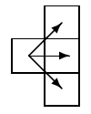
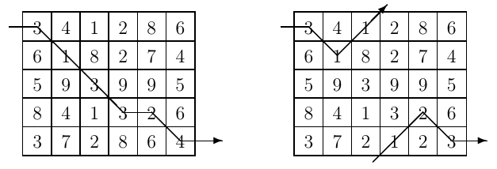
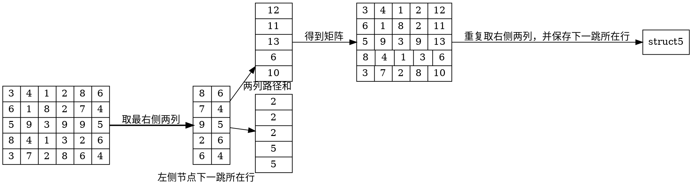

# Unidirectional TSP

## 1. 题目

Problems that require minimum paths through some domain appear in many different areas of computer science. For example, one of the constraints in VLSI routing problems is minimizing wire length. The Traveling Salesperson Problem (TSP) — finding whether all the cities in a salesperson’s route can be visited exactly once with a specified limit on travel time — is one of the canonical examples of an NP-complete problem; solutions appear to require an inordinate amount of time to generate, but are simple to check.

This problem deals with finding a minimal path through a grid of points while traveling only from left to right.

Given an m $\times$ n matrix of integers, you are to write a program that computes a pathof minimal weight. A path starts anywhere in column 1 (the first column) and consistsof a sequence of steps terminating in column n (the last column). A step consists of traveling from column i to column i + 1 in an adjacent (horizontal or diagonal) row. The first and last rows (rows 1 and m) of a matrix are considered adjacent, i.e., the matrix “wraps” so that it represents a horizontal cylinder. Legal steps are illustrated on the bleow.



The weight of a path is the sum of the integers in each of the n cells of the matrix that are visited.

For example, two slightly different 5 $\times$ 6 matrices are shown below (the only difference is the numbers in the bottom row).



The minimal path is illustrated for each matrix. Note that the path for the matrix on the right takes advantage of the adjacency property of the first and last rows.

### Input

The input consists of a sequence of matrix specifications. Each matrix specification consists of the row and column dimensions in that order on a line followed by m $\times$ n integers where m is the row dimension and n is the column dimension. The integers appear in the input in row major order, i.e., the first n integers constitute the first row of the matrix, the second n integers constitute the second row and so on. The integers on a line will be separated from other integers by one or more spaces. Note: integers are not restricted to being positive.

There will be one or more matrix specifications in an input file. Input is terminated by end-of-file. For each specification the number of rows will be between 1 and 10 inclusive; the number of columns will be between 1 and 100 inclusive. No path’s weight will exceed integer values representable using 30 bits.

### Output

Two lines should be output for each matrix specification in the input file, the first line represents a minimal-weight path, and the second line is the cost of a minimal path. The path consists of a sequence of n integers (separated by one or more spaces) representing the rows that constitute the minimal path.

If there is more than one path of minimal weight the path that is lexicographically smallest should be output.

Note: Lexicographically means the natural order on sequences induced by the order on their elements.

### Sample Input

5 6
3 4 1 2 8 6
6 1 8 2 7 4
5 9 3 9 9 5
8 4 1 3 2 6
3 7 2 8 6 4
5 6
3 4 1 2 8 6
6 1 8 2 7 4
5 9 3 9 9 5
8 4 1 3 2 6
3 7 2 1 2 3
2 2
9 10
9 10

### Sample Output

1 2 3 4 4 5
16
1 2 1 5 4 5
11
1 1
19

### 1.1. 题意

题意是给定一个矩阵，从最左边列往右按相邻的格子走，直至矩阵最后一列，找到一条路径的节点和最小，并且有多条路径和一样时，找到路径节点顺序最小的那条。注意矩阵是上下相通的，第一排可以走到最后一排，反之亦然。

## 2. 思路

碰到这个问题可以先讨论简化的情况：如果只有两列的情况，考虑左边节点A，判断A的最短路径只需考虑与A相邻的右边三个节点谁最小，如果有多个最小值相等，则需考虑这几个最小值的字典序，取最小值所在行最小的构成最短路径。对左边列的每一个节点都得到最短路径，然后比较左边列的路径和大小，就得到了矩阵的最短路径。
| 3 | 4 |
|:-:|:-:|
| 6 | 1 |
| 5 | 9 |
| 8 | 4 |
| 3 | 7 |

以上图为例，3的右侧相邻节点最小值为1，则3的路径和为4；同理可求出6，5，8，3的路径和：
| 4 |
|:-:|
| 7 |
| 6 |
| 12 |
| 7 |

注意第5排的3，与之相邻的有第1排的4，第4排的4，第5排的7，由于1排与4排值相等，则比较排数，排数小的路径节点序号更小，所以这里第5排的3路径是3(第5排)-4(第1排)。

将问题推广到多列矩阵中，由于最右侧一列已无值，按照上述两列矩阵路径的求法，我们可以得到从右至左第二列的路径和，并得到路径。此时可以抛弃右数第一列，将右数第二列看作最后一列；依此类推，不断从矩阵中取出右数两列，直到左数第一列，我们就得到了每个起始节点的最短路径和，和路径，比较左数第一列的路径和，取最小值就得到了最短路径和，和路径。

这里最关键的是记录中间列的节点和和下一跳节点。



### 2.1问题

#### 2.1.1 实现上的问题

#### 2.1.2 性能上的问题

## 3. 实现

```JAVA
import java.io.File;
import java.io.FileNotFoundException;
import java.util.ArrayList;
import java.util.Collections;
import java.util.List;
import java.util.Scanner;

public class Main {

    public static void main(String[] args) {
        File file = new File("number.txt");
        Scanner scanner = null;
        try {
            scanner = new Scanner(file);
        } catch (FileNotFoundException e) {
            throw new RuntimeException(e);
        }
//        Scanner scanner = new Scanner(System.in);
        while (scanner.hasNextInt()) {
            int row = scanner.nextInt();
            int col = scanner.nextInt();
            int[][] matrix = new int[row][col];
            for (int i = 0; i < row; i++) {
                for (int j = 0; j < col; j++) {
                    matrix[i][j] = scanner.nextInt();
                }
            }

            int[][] dpnumbers = new int[row][col];
            int[][] dppaths = new int[row][col];

            for (int i = 0; i < row; i++) {
                dpnumbers[i][col - 1] = matrix[i][col - 1];
            }

            //从右往左第二列开始，逐步得到每一个节点的最短路径和下一跳所在行
            for (int j = col - 2; j >= 0; j--) {
                for (int i = 0; i < row; i++) {
                    int upj = (i - 1 + row) % row;
                    int rowj = i;
                    int downj = (i + 1) % row;
                    int minValue = minVal(dpnumbers[upj][j + 1], dpnumbers[rowj][j + 1], dpnumbers[downj][j + 1]);
                    List<Integer> list = new ArrayList<>();

                    list.add(upj);
                    list.add(rowj);
                    list.add(downj);
                    Collections.sort(list);
                    //如果有多个最小值，取所在行最小的构成字典序最小的路径
                    for (Integer val : list) {
                        if (dpnumbers[val][j + 1] == minValue) {
                            dpnumbers[i][j] = matrix[i][j] + minValue;
                            dppaths[i][j] = val;
                            break;
                        }
                    }
                }
            }

            //比较第一列节点(起始节点)的路径和，取最小值。如果有多个最小值，取起始节点所在行最小的节点
            int minVal = Integer.MAX_VALUE;
            int rowIndex = 0;
            for (int i = 0; i < row; i++) {
                //如果存在多个最小值，要取起始节点行最小，所以这里要用小于号
                if (dpnumbers[i][0] < minVal) {
                    minVal = dpnumbers[i][0];
                    rowIndex = i;
                }
            }

            List<Integer> paths = new ArrayList<>();
            paths.add(rowIndex);
            for (int j = 0; j < col - 1; j++) {
                rowIndex = dppaths[rowIndex][j];
                paths.add(rowIndex);
            }
            System.out.printf("%d", paths.get(0) + 1);
            for (int i = 1; i < paths.size(); i++) {
                System.out.printf(" %d", paths.get(i) + 1);
            }
            System.out.printf("\n");
            System.out.println(minVal);
        }
    }

    public static int minVal(int a, int b, int c) {
        int temp = a > b ? b : a;
        temp = temp > c ? c : temp;
        return temp;
    }
}
```
